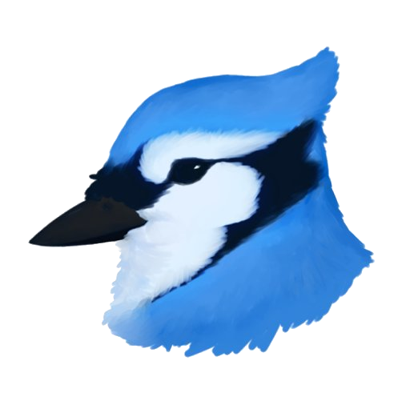
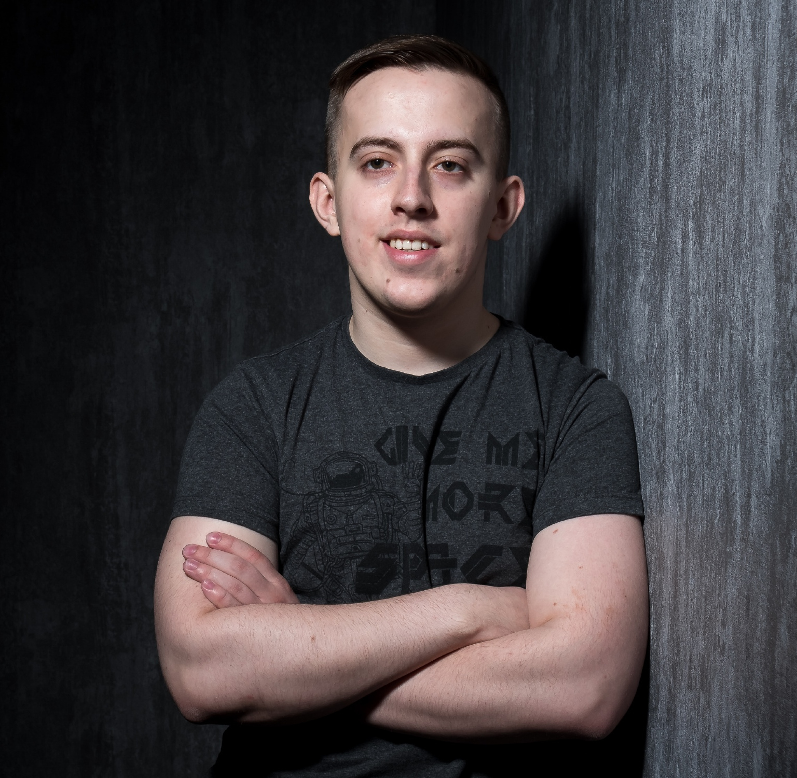

## Developer, Project zomboid modder  
#### I like to do impossible things

### Hi, I am Aiteron 

#### I am creator mods for Project Zomboid: 
* [Better towing](https://steamcommunity.com/sharedfiles/filedetails/?id=2241990680)
* [Better lockpicking](https://steamcommunity.com/sharedfiles/filedetails/?id=2368058459)
* [Aquatsar Yacht Club](https://steamcommunity.com/sharedfiles/filedetails/?id=2392987599) (co-author)
* [Gun suicide](https://steamcommunity.com/sharedfiles/filedetails/?id=2402057349)
* [AUD - Aiteron Userfriendly Debug](https://steamcommunity.com/sharedfiles/filedetails/?id=2340608427)

### Mods in developing
* NPC mod
* Basement mod

### Statistics
- In real life: Alexander Blinov
- Russian
- Developer (Lua, C++, Java)
- Student of IT University
- Project Zomboid modder (700+ hours of PZ modding)
- Known langs: Russian, English

#### Me IRL

### Links
[Patreon]() // Soon    
[Steam profile](https://steamcommunity.com/profiles/76561198211669377/)   
[YouTube channel](https://www.youtube.com/c/Aiteron)     
[Discord server](https://discord.gg/EjQhFSUh)  
